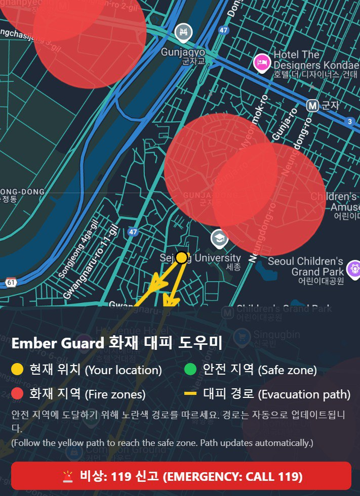

> 📢 **Notice:**  
> All teams submitting their project must create a `README.md` file following this guideline.  
> Please make sure to replace all placeholder texts (e.g., [Project Title], [Describe feature]) with actual content.

# 🛠️ Ember Guard

### 📌 Overview
This project was developed as part of the AGI Agent Application Hackathon. It aims to reduce human damage and loss due to residential fires. The project is a robot that maps out the fires in a small location and broadcasts it while looking for nearby people to guide to safety.

### 🚀 Key Features
- ✅ **Feature 1**: The robot is able to find the shortest path and live maps the area
- ✅ **Feature 2**: Uses AI to create broadcast messages.
- ✅ **Feature 3**: If no safe path is available, the robot is able to create one by managing small fires

### 🖼️ Demo / Screenshots
  
[Optional demo video link: e.g., YouTube]

### 🧩 Tech Stack
- **Frontend**: [e.g., React, Vue, HTML/CSS]
- **Backend**: [e.g., Node.js, Flask, Django]
- **Database**: [e.g., MongoDB, MySQL, Firebase]
- **Others**: [e.g., OpenAI API, LangChain, HuggingFace, Docker]

### 🏗️ Project Structure
```
📁 emberguardt/
├── Arduino/
├── index.html
├── App
├──README.md
```

### 🔧 Setup & Installation

```bash
# Clone the repository
git clone https://github.com/rayyanafzal/emberguard.git

# map prototype
cd App
npm install
npm start

```


### 🙌 Team Members

| Name        | Role               | GitHub                             |
|-------------|--------------------|------------------------------------|
| Mina Eskandar     | Developer | [@minarashad](https://github.com/minarashad) |
| Haya Emizwghi |  Developer  | [@hayooota](https://github.com/hayooota) |
| Rayyan afzal |  Developer  | [@rayyanafzal](https://github.com/rayyanafzal) |


### ⏰ Development Period
- Last updated: 2025-04-13

### 📄 License
This project is licensed under the [MIT license](https://opensource.org/licenses/MIT).  
See the LICENSE file for more details.
